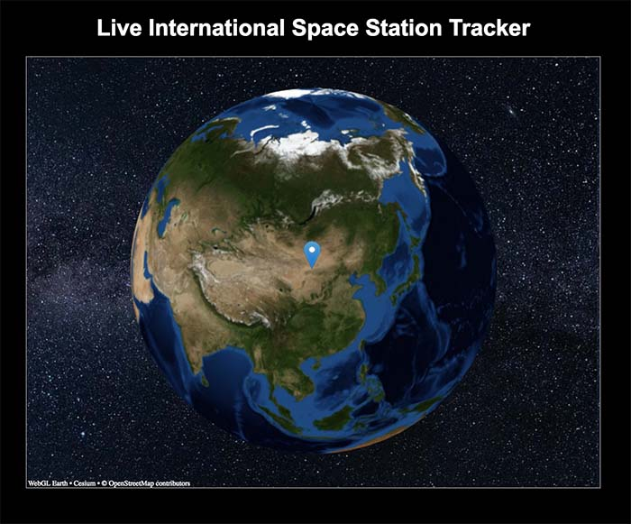

# Live International Space Station Tracker

Using [WebGL Earth](http://www.webglearth.org/api) and [Open Notify ISS Location](http://open-notify.org/Open-Notify-API/ISS-Location-Now/) data to create a live ISS tracker

